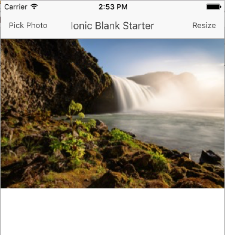
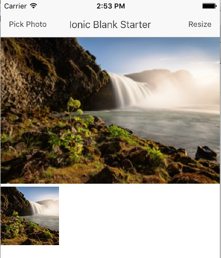

# Cordova Plugin ImageCropResizer

A Cordova Plugin to crop/resize the image.

## Sample

```
    ImageCropResizer.cropResize(function(data) {   
      $scope.image = "data:image/jpeg;base64," + data.imageData;
      setTimeout(function() {
        $scope.$apply();
      });      
    }, function(error) {
      alert(error);      
    }, $scope.imageData, 100,100, null);    
```

### Original image



### Image after crop/resize



## Reference

https://cordova.apache.org/docs/en/latest/guide/hybrid/plugins/index.html

## Notice

Have to remove the plugin and add it again after the plugin modified.